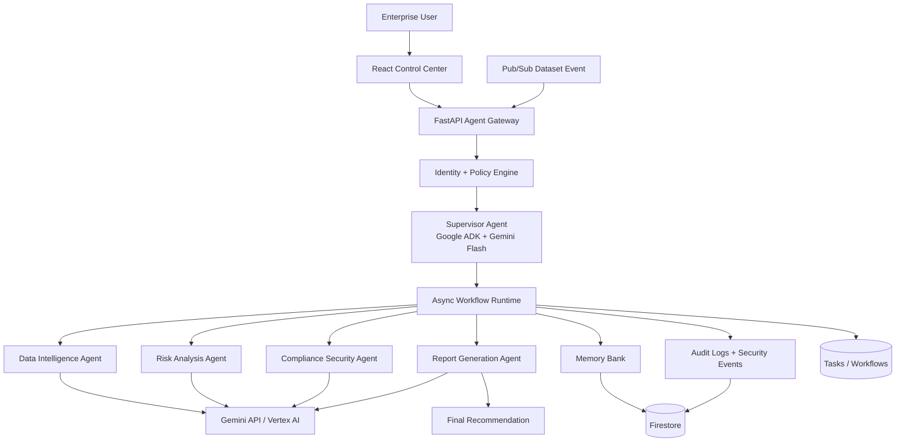

# AgentSphere OS

## Project Overview

AgentSphere OS is an enterprise operating platform for autonomous AI agents, built for Google's **Fortified Enterprise Fleet** category. It governs an AI workforce from registration through execution: approved agents are discovered, authenticated, authorized, coordinated, remembered, monitored, and audited.

This is not a chatbot. It is a multi-agent control plane for long-running business workflows such as supplier onboarding risk assessment.

## Problem Statement

Enterprises are deploying finance, HR, security, support, and data agents without a shared operating layer. Teams cannot reliably answer which agents exist, what data they can access, which tools they may call, whether an action was safe, or why a decision was made. AgentSphere OS provides that missing governance and execution layer.

## Architecture



The storage adapter uses Firestore when `GOOGLE_CLOUD_PROJECT` is configured and a durable local JSON file for zero-cost development. Cloud Run runs the API with scale-to-zero; Pub/Sub can trigger the dataset event endpoint.

## Agents

- **Supervisor Agent** — understands the business goal, selects approved agents, creates an ordered plan, and tracks progress.
- **Data Intelligence Agent** — validates evidence, detects anomalies, and summarizes data quality findings.
- **Risk Analysis Agent** — evaluates historical context, calculates a supplier risk score, and recommends actions.
- **Compliance Security Agent** — checks sensitive data, policy constraints, and unsafe instructions.
- **Report Generation Agent** — combines specialist outputs into an executive recommendation.

All agents use the shared Gemini reasoner and are instantiated as Google ADK agents when the ADK package is available.

## Core Features

- Firestore-backed agent registry with versions, owners, capabilities, permissions, approval state, timestamps, and enable/disable controls.
- Async workflow runtime with queued/running/completed/failed states, task records, retries, execution latency, and failure propagation.
- Gateway identity and resource authorization before specialist execution.
- Model Armor-inspired input inspection for prompt injection, PII, and unsafe instructions.
- Short-term workflow context plus long-term entity memory.
- Audit logs with workflow, agent, action, input hash, output summary, status, tools, and latency.
- React workflow dashboard with live polling, workflow details, task timeline, output, errors, and loading/retry states.

## Setup

### Backend

```powershell
cd backend
python -m venv .venv
.\.venv\Scripts\Activate.ps1
pip install -r requirements.txt
Copy-Item .env.example .env
python run.py
```

Configure `.env` for Gemini API key mode:

```dotenv
GEMINI_API_KEY=your_google_ai_studio_key
GEMINI_MODEL=gemini-flash-latest
GOOGLE_GENAI_USE_VERTEXAI=false
```

For Vertex AI mode, use Application Default Credentials (`gcloud auth application-default login`) and:

```dotenv
GOOGLE_GENAI_USE_VERTEXAI=true
GOOGLE_CLOUD_PROJECT=your-project-id
GOOGLE_CLOUD_LOCATION=us-central1
GEMINI_MODEL=gemini-flash-latest
```

### Frontend

```powershell
cd frontend
npm install
npm run dev
```

Set `VITE_API_URL` when the API is not on the default `http://localhost:8080/api`.

## API Endpoints

- `GET /health` — service and persistence health.
- `GET /api/agents` — discover agents; `POST /api/agents` — register an agent.
- `GET /api/agents/{agent_id}` — retrieve one registered agent.
- `GET /api/agents/search?capability=risk_scoring` — capability discovery.
- `PATCH /api/agents/{agent_id}/enabled?enabled=false` — disable or enable an agent.
- `POST /api/workflows` — create an async governed workflow.
- `GET /api/workflows` — list workflow summaries.
- `GET /api/workflows/{workflow_id}` — full workflow state.
- `GET /api/workflows/{workflow_id}/tasks` — task execution records.
- `GET /api/workflows/{workflow_id}/summary` — completed/failed agents, duration, and final report.
- `GET /api/audit-logs` — agent execution evidence.
- `GET /api/security-events` — blocked actions and policy events.
- `GET /api/memories` — persisted entity context.
- `POST /api/safety/inspect` — inspect text before orchestration.
- `POST /api/events/dataset-upload` — Pub/Sub-compatible event trigger.
- `GET /api/gemini/verify` — verify every configured agent's Gemini path.

## Demo Workflow

Submit `Evaluate supplier ABC before onboarding` to `POST /api/workflows`. The gateway inspects the request, the supervisor creates a four-step plan, then the runtime executes Data Intelligence, Risk Analysis, Compliance Security, and Report Generation agents in order. Each step receives recalled supplier memory and prior outputs. The result persists workflow/task state, updates `supplier_ABC` memory, and emits audit/security evidence.

## Technology Stack

Python, FastAPI, Google ADK, Gemini Flash, Google Gen AI SDK, Firestore, Pub/Sub-compatible events, Cloud Run, React, Vite, and local JSON fallback. The design avoids paid databases, always-on servers, Kubernetes, and paid observability products.

## Cloud Run Deployment

The production deployment uses the root `Dockerfile`, which builds the React bundle and packages it with the FastAPI service for one Cloud Run URL. Run `./deploy.ps1 -ProjectId YOUR_PROJECT_ID -Region us-central1`; it enables required APIs, builds the image with Cloud Build, configures the runtime service account for Firestore and Vertex AI, and applies `backend/cloudrun.yaml`. Keep Cloud Run minimum scale at zero for cost control. Configure a Pub/Sub push subscription with authenticated invocation to `/api/events/dataset-upload`.

## Submission Notes

Run `python test_gemini.py` from `backend` to verify the configured Gemini path. The local fallback remains available when credentials or external network access are unavailable. For the live hackathon demo, run from a network-enabled environment with a valid AI Studio key or Vertex AI ADC.

## Environment Variables

| Variable | Purpose | Default |
|---|---|---|
| `GEMINI_API_KEY` | Google AI Studio credential when Vertex AI mode is disabled | unset |
| `GEMINI_MODEL` | Gemini model passed to ADK and Gen AI SDK | `gemini-flash-latest` |
| `GOOGLE_GENAI_USE_VERTEXAI` | Select Vertex AI when `true`; API key mode when `false` | `false` |
| `GOOGLE_CLOUD_PROJECT` | GCP project for Firestore/Vertex AI | unset |
| `GOOGLE_CLOUD_LOCATION` | Vertex AI region | `us-central1` |
| `GEMINI_TIMEOUT_SECONDS` | Per-call timeout | `45` |
| `GEMINI_MAX_RETRIES` | Transient retry count | `2` |
| `FIRESTORE_DATABASE` | Firestore database name | `(default)` |
| `LOCAL_DATA_FILE` | Local fallback persistence path | `.data/agentsphere.json` |

Never commit `backend/.env`; submit only `backend/.env.example`.

## Frontend Coverage

The canonical frontend is `frontend/`, started with Vite. The implemented React flow is the Workflow Dashboard: it creates workflows, polls live workflow records, opens workflow details, and displays progress, task timeline, outputs, failures, and execution latency. Registry, security, memory, audit, safety, and Gemini verification are available through the documented backend APIs. The root `index.html` is a legacy standalone shell and is not the canonical React entry point.
