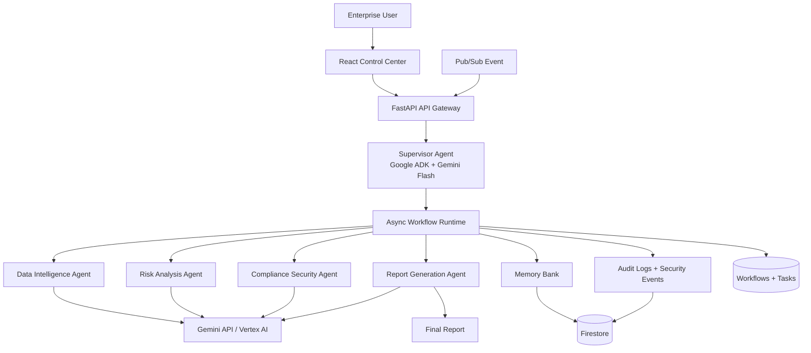

# AgentSphere OS Architecture

```mermaid
flowchart TD
    User[Enterprise User] --> Frontend[React Control Center]
    Frontend --> Gateway[FastAPI API Gateway]
    Gateway --> Supervisor[Supervisor Agent<br/>Google ADK + Gemini Flash]
    Supervisor --> Runtime[Async Workflow Runtime]
    Runtime --> Data[Data Intelligence Agent]
    Runtime --> Risk[Risk Analysis Agent]
    Runtime --> Security[Compliance Security Agent]
    Runtime --> Report[Report Generation Agent]
    Data --> Model[Gemini API / Vertex AI]
    Risk --> Model
    Security --> Model
    Report --> Model
    Runtime --> Memory[Memory Bank]
    Runtime --> Audit[Audit Logs + Security Events]
    Memory --> Firestore[(Firestore)]
    Audit --> Firestore
    Runtime --> Tasks[(Workflows + Tasks)]
    Report --> Final[Final Report]
    PubSub[Pub/Sub Event] --> Gateway
```
